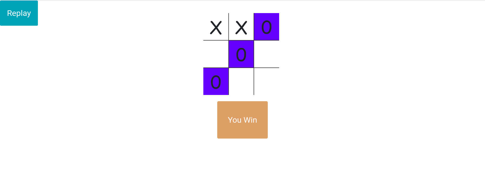

# tic_tac_toe_game
simple tic tac toe game written in JS

## Installation

Clone this repo.

```bash
git clone https://github.com/tienv1per/tic_tac_toe_game.git
```

## Usage
Open HTML file with live server mode.
Click button "START" to start the game or to the replay the game after finishing.
In this project, bot is created using minimax algorithm so you will find little bit harder to win this :v.

Demo of this game.

You can try demo [here](https://gameoccho.w3spaces.com/)





## Contributing

Pull requests are welcome. For major changes, please open an issue first
to discuss what you would like to change.

Please make sure to update tests as appropriate.

## License

[MIT](https://choosealicense.com/licenses/mit/)
